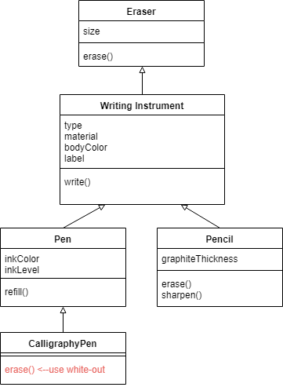

# OOP?
OOP is Object Oriented Programming, an approach or mindset for breaking large, complex products into simple solutions.

The main concept is that you can group data and related actions/behaviors together and treat them as a single entity.

- An item containing attributes and behaviors is called an `object`
- The characteristics are called `properties` or `attributes` of the object.
- The actions are called `methods` of the object.

We already use objects in the form of POJOs and Arrays but we can also create custom Object Classes:
```javaScript
Class Animal {
    // this is the factory, it creates an instance of the Animal class based on the args provided
    constructor(name, numLegs, type) {
        // `this` is setting the properties of this class instance and is referred to as the context
        this.name = name;
        this.numLegs = numLegs;
        this.type = type;

        Animal.animalCount++;
    }
    // static variables are assigned to the class not to an instance
    static animalCount = 0;

    // instance methods are ran by an instance
    eat(food) {
        return `${this.name} eats ${food}.`
    }
    move() {
        if (this.numLegs > 0) {
            return `${this.name} walks.`
        } else {
            return `${this.name} slithers.`
        }
    }

    //static methods are ran by the class itself
    static getTypeCount(...animals) {
        let count = {}

        animals.forEach(animal => {
            if (count[animal.type]) {
                count[animal.type]++;
            } else {
                count[animal.type] = 1;
            }
        })

        return count;
    }
}

// save an instance of the Animal class as cat
let cat = new Animal('cat', 4, 'mammal');
let snake = new Animal('snake', 0, 'reptile');

console.log(cat);
console.log(cat.name, cat.numLegs, cat.type);
console.log(cat.eat);
console.log(snake);
console.log(snake.move());

console.log(cat instanceOf Animal); //true
console.log(snake instanceOf Animal); //true

console.log(Animal.getTypeCount(cat, snake))
console.log(Animal.animalCount);
```

## 3 Pillars of OOP
### Encapsulation
`Encapsulation` is to put the behaviors and data together behind an API (Application Programming Interface) to hide the implementation details.
- We don't need to know how `Array.map()` works exactly to know that we need to provide a callback function for each element and that we'll receive a new array.
- The implementations and complexity hidden are inside of a `black box`.

A common example of encapsulation is with a vending machine:
- We know that if you give money and select an item, the machine will give the item (`API`).
- We don't need to know how much money is in the machine (a `property`) or how the money is being sorted and counted (`methods`). Those details are hidden inside of the machine (`object`).
### Inheritance
This means child classes of other classes have access to all the `methods` and `properties` of their ancestors.
- A class `Cat` inherits the `eat()` and `move()` methods from thier parent `Animal`.

```javaScript
// creates Cat class as a child of Animal class
class Cat extends Animal {
    constructor(name, size) {
        // the super function runs the constructor from the parent taking in any needed args
        super(name, 4, 'mammal');
        this.size = size;
    }

    roar() {
        return `${this.name} roars!`
    }
}

let tiger = new Cat('tiger');
console.log(tiger)
console.log(tiger.eat('meat'));
console.log(tiger.roar());
console.log(cat.roar()); // nah fam

console.log(cat instanceOf Cat) //false
console.log(tiger instanceOf Animal) //true
```
### Polymorphism
`Polymorphism` refers to the processing of various data types and classes through a single uniform interface. We have to primary types:
- `Overloading` : Sending a different number or type of parameter to a function.
```javascript
// both functions return the same thing but one takes in n number of integers and the other takes in an array.
sum(1, 2, 3, 4, 5) // 15
sum([1, 2, 3, 4, 5]) // 15
```
- `Overriding` : A child class changing a behavior of a parent class. An pencil removes text with an eraser but a pen uses white-out.
