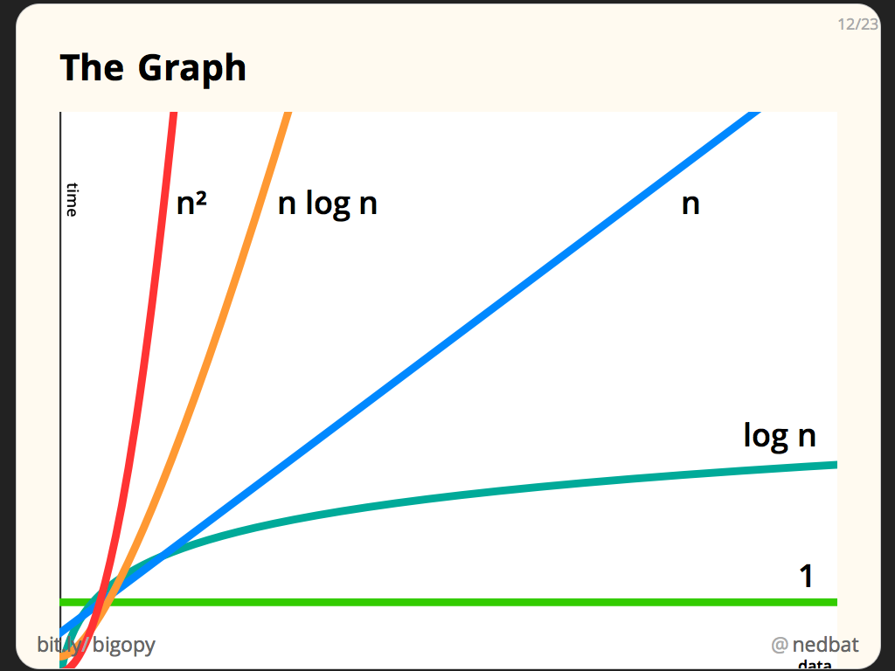
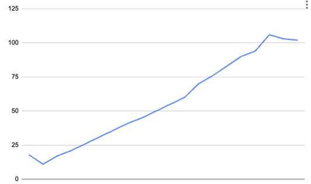

# Computer Science

Before we begin, I want to mention that the next 4 weeks will be building upon information we have already learned while also building on information we will learn. These next 4 weeks will be the end of the introduction to JavaScript. It will be tough, but if you have made it this far understanding the concepts and being able to apply them on your own, you are doing good!

This is the stuff you HAVE to know if you want to get a job. I will be asking common interview questions regarding this content throughout the next 4 weeks.

## Big-O

Big O or Big Order is a mathematical term we use to describe the time or space complexity in computer science. We use Big O to think about the WORST CASE scenario, and how code we write works under the hood over time in respect to the Space/Time consumed.

### Space Complexity

Space Complexity refers to the amount of space code we run consumes. It is often in reference to computer memory, but can also be used in consideration with computer storage.

    - Computer Memory: Used for short-term memory tasks that affect performance and rendering
    - Computer HardDrive: Used for long-term memory

Consider the following piece of code:

```js

let arr = [];

for(let i = 0; i < 1_000_000; i++){
    arr.push(i);
}

```

Here, we are pushing data into the array 1Million times. This data must persist because if we want to call "arr", then it will tell us what is located within each index, as well as the size. Our code, when ran, consumes computer processing power and the amount of processing power it consumes or needs is what we refer to when considering Space Complexity.

So when we have an empty array, how big is it at start? how big will it need to be at the end? How big is it getting on each loop iteration? These are all things we need to consider in computer science and with respect to space complexity


### Time Complexity

Time complexity refers to the idea that our code will take time to perform. Each piece of the code will take some time to run, but we are more concerned with the growth of that time consumption over a period of time. For exampele:

```js
let arr = [];

for(let i = 0; i < 1_000_000; i++){
    arr.push(i);
}
```

How long will this for loop take, what is the growth curve of this for loop over time? Is it always the the same?


### Denotations of BIG O

We are considering the curvature of the space/time complexity of code. When doing so, we denoate it using the following phrases:

- O(1): Constant - Refers to the growth being consistent over execution time. Example: consistently taking 1ms per line of code
- O(log n): Growth at log n rate
- O(N): Linear - Refers to the growth growing at a predictable range. Example: Consistently doubling per exection time
- O(n log n): Growth at n log n rate
- O(N^2): Squared - Refers to the growth growing at a squared increase
- O(N^3): Cubed - refers to the growth growing at a cubed increase.




Let's take a look at a function:

```js

function someComplexity(n){
    for(let i = 0; i < 100; i++){
        console.log("hello world");
    }
}

someComplexity(5);


```

In this example, we are iterating our function 100 times. we are not using the "n" variable, which can change with each function call. So in regards to TIME complexity, we are growing constant. This for loop will run 100 times every time. Now if we change it out to use "n"

```js
function someComplexity(n){
    for(let i = 0; i < n; i++){
        console.log("hello world");
    }
}

someComplexity(5);
someComplexity(100);
someComplexity(1_000_000);

```
The for loop can run 5, or 100, or 1_000_000, or n number of times. We do not know how long that for loop will take, but only that the for loop time will grow based on the amount of iterations it needs to do. In this case, the growth is linear over time, or O(N)


### Checking performance

We can check perfomance in many ways in JavaScript. Some of the easiest ways is to use the `Date.now()` functionality to create a start and end time. Then we can subtract the difference in time between each marker.

With this, we can wrap some functionality to see how long code takes to perform.

```js
function addNums(n) {
    total = 0;

    for (let i = 1; i <= n; i++) {
        total += i;
    }

    return total;
}


let increment = 1000000
for (let n = increment; n <= 20 * increment; n += increment) {
    startTime = Date.now();
    addNums(n);
    endTime = Date.now();

    console.log(`${endTime - startTime}`);
}

```

This function will print out, in ms, the amount of time it takes to run the addNums function many times with a growth on the amount of times we loop each time.

We will get an output like:

```
18
11
17
21
26
31
36
41
45
50
55
60
70
76
83
90
94
106
103
102
```

Note: These can vary slightly on each run/computer. What we care about is how consistently the differences are, and the overall growth of time per execution. Here, we should see a Linear growth as our for loop runs `n` number of times. If we take these numbers and throw it in a google sheet we can create a graph:


