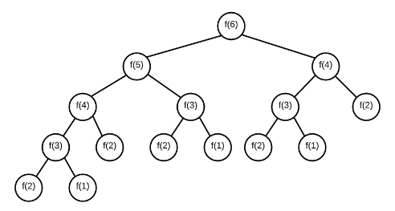

# Caching and Sets

Imagine you are in a kitchen, and your job is to make cake for customers. You want to make cakes fast and efficient, yet you still want to retain quality. You have a couple of ways you can achieve this.

1. You could make hundreds of cakes in one sitting, but then you aren't guaranteed to deliver quality. You may not even sell all of them.

2. You can prep all the ingredients and just mix them and bake them when ready to order, but this may take up additional storage space and you may over-use ingredients depending on the demand

3. You can prep each cake from scratch everytime it is ordered, but this can take time per order.

The most efficient and cost saving option is ususally number 2. This is because you can "cache" the intensive labor of prepping ingredients and getting everything ready, yet still achieve quality results quickly. Sure, you take up additional space but now you can complete ordered quickly, which can free up your time to work on additional menu items.

This is what we want to replicate in a computer world


## Memoization

This is the process of saving the results of a variable in memory. If you have a function that needs to get ran often, and the results are the same, rather than spend time computing that process repeatedly, we can just save the results in an `object`.


The Fibonaci Example:

Without Memoization:

```js

function fib(n){
    console.log(`Running fib(${n})`);
    if(n === 1) return 0;
    if(n === 2) return 1;
    return fib(n-1) + fib(n - 2);
}

```

This will work perfectly fine, and our computers are lighnting fast so we can achieve some pretty good results when working with small data. Remember, when dealing with Space and Time Complexity we have to think about the overall growth of space/time as the data we work with increases.

We are doing a lot of repeated tasks in this example, because if you know "n" at 5 returns the same  nodes (n at 4 and n at 3) then you can save the previous results as a reference. This means you only have to process new information, and not old information.




With memoization, we can save these results and avoid having to compute things we have already computed before.


```js
const cache = {};

function fibMemo(n){
    if(n === 1) return 0;
    if(n === 2) return 1;
    if(!cache[n]){ // if we have not computed the results before, add it
        cache[n] = fibMemo(n - 1) + fibMemo(n - 2);
    }
    return cache[n];
}

```


Before Memoization, we would be waiting 10+ seconds just at 50. Imagine how long it would take at 100 (probably 30 min +), but with memoization, we can easily hit 5,000 in 1ms processing time.


## Sets

Sets are another data structure that work almost like a cross between an array and an object.

On instantiation, they take an iterable, and we can store them in a cache. Unlike Arrays, but similar to objects, `Sets` take unique items. THIS IS SUPER IMPORTANT TO REMEMBER FOR COORDINATES

We can do the following:

- retrieve from a set in O(1) time
- Add to a set in O(1) time
- search for data in O(1) time
- loop through them in O(n) time

```js

const mySet = new Set([1,2,3,4,5,6,7,8,9]); // unique values only

console.log(mySet.has(1)); // same as .includes but O(1);
mySet.add(2); // same as adding a key-value pair, but also O(1);
mySet.forEach((el) => { // works the same as Array.forEach. Still O(n)
    console.log(el);
})


```
